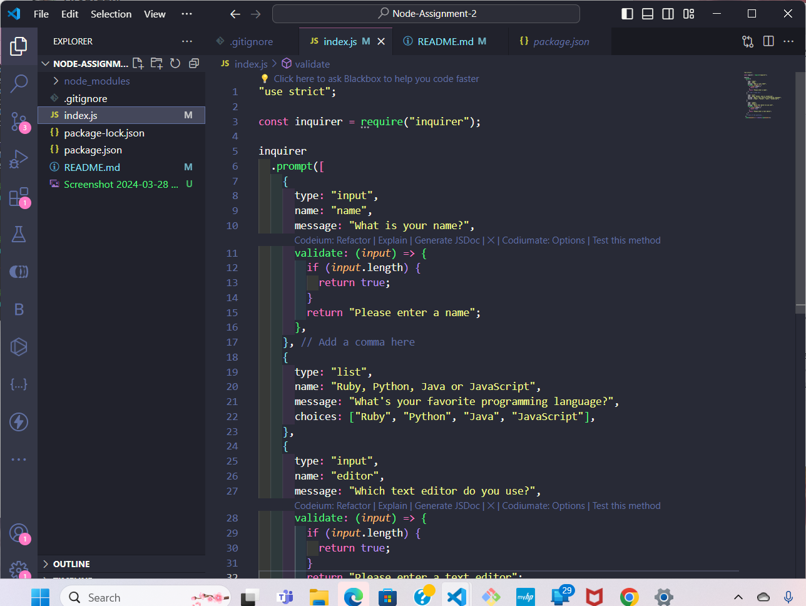

# Node-Assignment-2

This assignment is about npm modules. Using the npm inquirer package. I was abbe to make a survey get information. This assignment includes the following
input types and option values.

Here is the screenshot of my initiating node and my npm.js project.

## Instructions:

- Create a new repository.
- Clone it to your local machine.
- Write code that prompts users for their name, favorite language.
- Asks the user to choose their preferred editor.

### Documentation

To create a new repository on GitHub, follow these steps:

1. Go to [GitHub](https://github.com/) and sign in to your account.
2. Click on the plus icon in the top right corner to create a new repository.
3. Name your repository (e.github.com/my_username/assignment2).
4. Check the box(es) for "Initialize this repository with a README".
5. Click "Create repository" at the bottom of the page.
6. Once your repository has been created, you will be taken to its main page. From here you can see the URL needed to clone the repository.
7. Click "Clone or download" and select "Open in Desktop" to clone the repository to your local machine.

## NPM Modules

The inquirer module is put in the gitignore file to hide all the files that we dont want to upload to the repository.

Here is the image of the finished javascript.
